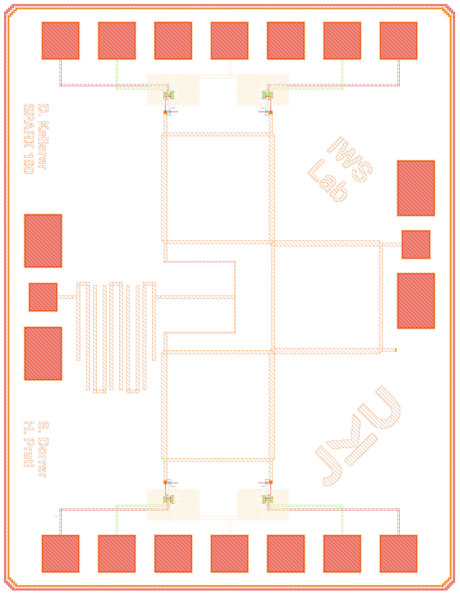
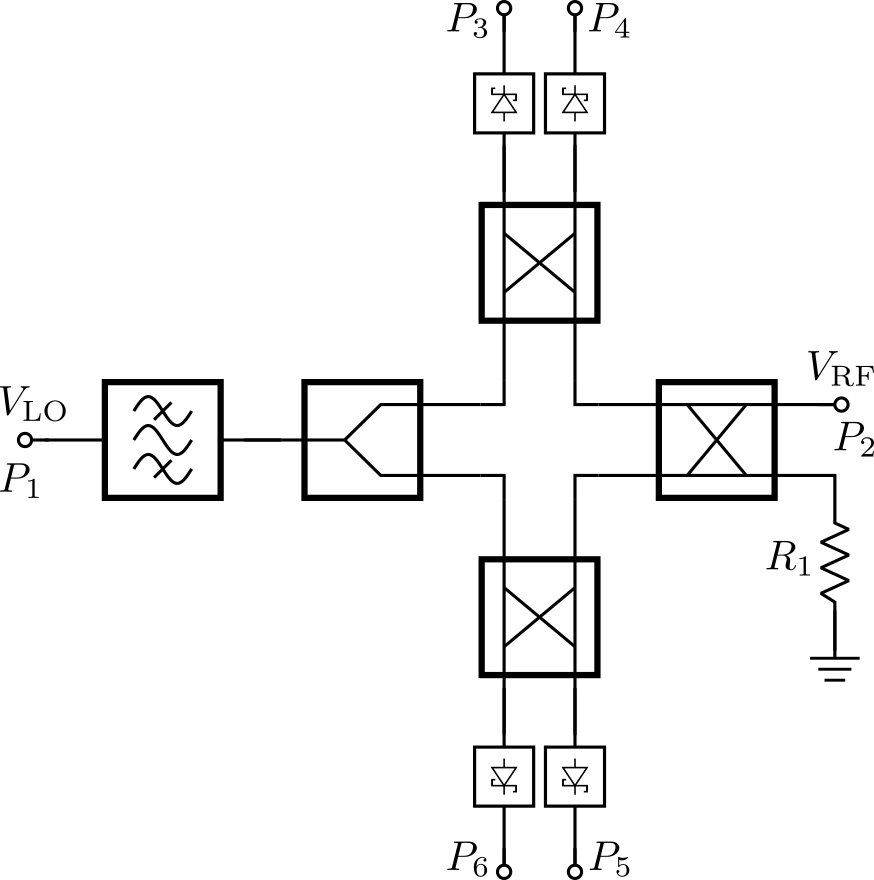
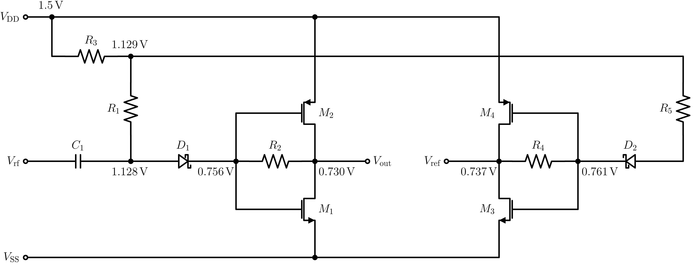

# SPARX: An Open-Source, Automated, Programmatically Generated, Frequency-Scalable Six-Port Receiver in 130-nm CMOS

(c) 2025-2026 David Kellerer-Pirklbauer, Simon Dorrer and Harald Pretl

> [!WARNING]
> This repository is a Work in Progress.

> [!IMPORTANT]
> This repository requires the [IIC-OSIC-TOOLS](https://github.com/iic-jku/IIC-OSIC-TOOLS) container with tag `2026.04` or later.

<p align="center">
  <a href="img/sparx160_top_white_wo_M5.png">
    
  </a>
  <br>
  <em>Render of the Six-Port Receiver for 160GHz without M5 GND plane.</em>
</p>


## Overview
SPARX stands for Six-Port Automated Receiver. The whole layout is generated in Python with self-made RF devices as a GDSFactory IHP PDK add-on. S-parameter simulation of the passive RF structures is done with AWS Palace. With KLayout, Magic, and Netgen, a complete LVS, DRC, and RCX verification flow is implemented. The SBD-based power detector is designed in Xschem and simulated with ngspice and VACASK. This whole repo is controlled by a Makefile. Just clone it and run `make all` to build and verify the area-optimized six-port receiver at 160 GHz. To generate a frequency-scalable layout at a different target frequency, for example 77 GHz, run `make build-flex-layout FREQ=77`. In the following video, the generation of six-port receivers from 60 GHz to 300 GHz in under one minute is demonstrated.

https://github.com/user-attachments/assets/a1e6cacb-4a70-4f2c-9b7a-f4b6fbb5a47a
<p align="center">
  <em>Generation of Six-Port Receivers from 60 GHz to 300 GHz.</em>
</p>


## Block Diagram
- Six-Port
  - Branch Line Coupler (BLC)
  - Wilkinson Power Divider (WPD)
  - Hairpin Coupled-Line Bandpass Filter (BPF)
- Power Detector (PD)
  - Schottky Barrier Diode (SBD)
- Metal Stack
  - TopMetal2 (TM2): RF traces
  - Metal5 (M5): GND plane

<p align="center">
  <a href="doc/figures/sparx_blockdiagram/sparx_blockdiagram.png">
    
  </a>
  <br>
  <em>Block Diagram of the Six-Port Receiver.</em>
</p>


## Schematic of SBD-based Power Detector

<p align="center">
  <a href="doc/figures/sparx_powdet_sbd/sparx_powdet_sbd_circuit.png">
    
  </a>
  <br>
  <em>Schematic of SBD-based Power Detector.</em>
</p>


## Chip Specifications

| Parameter           | Value                                                                             |
| ------------------- | --------------------------------------------------------------------------------- |
| Technology          | IHP SG13G2 (130nm CMOS)                                                           |
| Die Area            | 1000 × 1400 µm (1.4 mm²)                                                          |
| Supply Voltage      | 1.5 V                                                                             |


## ToDos
- [ ] KLayout LVS --> CMIM issues with PWell.block layer (@klayoutmatthias)
- [ ] KLayout PEX (2.5D) --> work in progress (@martinjanköhler)
- [ ] CaC - PR submission before April 15th 8:59 CET: @davkel99 & @simi1505
- [ ] GDSFactory Pins + Labels are not recognized by PEX: @davkel99
- [ ] Move remaining files from private repo to SPARX: @davkel99
- [ ] Add SPARX as module to private repo: @davkel99
- [ ] Change DBU from 5nm to 1nm in code: @davkel99
- [ ] Update GDSFactory IHP PDK `main` branch from `IHP-TO` branch: @davkel99
- [ ] Add Top-level Six-Port simulation in Xschem: @simi1505

## Makefile Targets

### Export Schematic Netlist for LVS

Exports the schematic netlist for LVS from Xschem and places it in `netlist/schematic/`.

The `EV_PRECISION` parameter sets the number of significant digits used by Xschem's `ev` function when calculating device properties (default: 5). Increase this to avoid LVS mismatches caused by floating-point rounding differences between Xschem and KLayout (see [xschem#465](https://github.com/StefanSchippers/xschem/issues/465)).

Note that currently, for the KLayout LVS `ntap` and `ptap` devices are extracted, and therefore the schematic netlist also needs to provide them. However, for the Magic + Netgen LVS `ntap` and `ptap` devices are not extracted. Therefore, in the schematic, the `lvs_ignore = short` command is used for these devices. To make these settings also effective for the schematic netlist export, the option `set lvs_ignore 1` must be set in the target `magic-lvs-netlist`.
Note that KLayout works with CDL netlists and Magic works with SPICE netlists. On the other hand, the target `klayout-lvs-netlist` uses the Xschem commands `set spiceprefix 1`, `set lvs_netlist 1`, `set top_is_subckt 1` and `set lvs_ignore 0`. However, the target `magic-lvs-netlist` uses the Xschem commands `set spiceprefix 1`, `set lvs_netlist 0`, `set top_is_subckt 1` and `set lvs_ignore 1`.

To extract a CDL schematic netlist for KLayout LVS, use the following target:
```sh
make klayout-lvs-netlist
make klayout-lvs-netlist CELL=sparx_powdet_sbd
make klayout-lvs-netlist EV_PRECISION=5
```

To extract a SPICE schematic netlist for Magic + Netgen LVS, use the following target:
```sh
make magic-lvs-netlist
make magic-lvs-netlist CELL=sparx_powdet_sbd
make magic-lvs-netlist EV_PRECISION=5
```

### Layout Versus Schematic (LVS)

Exports the schematic netlist from Xschem, then runs LVS. Compares the GDS layout in `layout/` against the schematic netlist in `netlist/schematic/`. Reports are saved to `verification/lvs/`. The extracted layout netlist is moved to `netlist/layout/`.

**KLayout LVS** uses `run_lvs.py` from the IHP Open-PDK:

```sh
make klayout-lvs
make klayout-lvs CELL=sparx_powdet_sbd
```

**Magic + Netgen LVS** uses `sak-lvs.sh`:

```sh
make magic-lvs
make magic-lvs CELL=sparx_powdet_sbd
```

### Design Rule Check (DRC)

Runs DRC on the GDS layout in `layout/`. Reports are saved to `verification/drc/`.

**KLayout DRC** uses `run_drc.py` from the IHP Open-PDK with relaxed rules (FEOL, density checks, and extra rules disabled):

```sh
make klayout-drc
make klayout-drc CELL=sparx_powdet_sbd
```

**KLayout DRC (regular)** runs the full DRC rule set on the top-level cell:

```sh
make klayout-drc-regular
```

**Magic DRC** uses `sak-drc.sh`:

```sh
make magic-drc
make magic-drc CELL=sparx_powdet_sbd
```

### Parasitic Extraction (PEX)

Runs parasitic extraction on the GDS layout in `layout/`. The extracted SPICE netlist is written to `netlist/pex/`.

The `EXT_MODE` parameter selects the extraction mode:
- `1` = C-decoupled
- `2` = C-coupled
- `3` = full-RC (default)

> **Note:** For `klayout-pex`, `EXT_MODE=1` (C-decoupled) is not yet supported by kpex and automatically falls back to `EXT_MODE=2` (CC) with a warning.

The `.subckt` name in the extracted SPICE file is automatically renamed from `<CELL>_flat` (kpex) or `<CELL>` (Magic) to `<CELL>_pex`.

If a matching Xschem symbol (`schematic/<CELL>_pex.sym`) exists, the `.subckt` pin order in the extracted SPICE file is automatically reordered to match the symbol's pin positions. This ensures the PEX netlist can be used directly with the corresponding Xschem symbol for simulation.

**KLayout PEX** uses `kpex` with the Magic extraction engine currently (2.5D engine is work in progress):

```sh
make klayout-pex
make klayout-pex CELL=sparx_powdet_sbd
make klayout-pex CELL=sparx_powdet_sbd EXT_MODE=3
```

**Magic PEX** uses `sak-pex.sh`:

```sh
make magic-pex
make magic-pex CELL=sparx_powdet_sbd
make magic-pex CELL=sparx_powdet_sbd EXT_MODE=3
```

### Verify a Specific Cell

Runs LVS, DRC, and PEX for a specific cell:

```sh
make klayout-verify-cell CELL=sparx_powdet_sbd
make magic-verify-cell CELL=sparx_powdet_sbd
```

### Verify Top Cell

Runs LVS, DRC, and PEX for the top cell:

```sh
make klayout-verify-top
make magic-verify-top
```

### Render Layout of the Design

Renders the top-level GDS layout and saves it in the `img/` folder:

```sh
make render-image
```

### Build PDK

Clones and installs the IHP-Open-PDK repository with GDSFactory cells:

```sh
make build-pdk
```

### Build Area-Optimized Layout

Generates the area-optimized six-port layout GDS files (`layout/sparx_top.gds` and `layout/sparx_powdet_sbd.gds`) at the fixed 160 GHz design frequency:

```sh
make build-opt-layout
```

### Build Frequency-Scalable Layout

Generates the frequency-scalable six-port layout GDS files (e.g. `layout/sparx160_top.gds` and `layout/sparx160_powdet_sbd.gds` for the default 160 GHz, or `layout/sparx77_top.gds` and `layout/sparx77_powdet_sbd.gds` for 77 GHz):

```sh
make build-flex-layout
make build-flex-layout FREQ=77
make build-flex-layout FREQ=77 NO_FILL=1
make build-flex-layout FREQ=77 NO_FILL_M5=1
```

The `FREQ` parameter sets the design frequency in GHz (default: `160`). `NO_FILL=1` disables metal fill (faster for layout preview). `NO_FILL_M5=1` disables only the Metal5 ground fill.

### Build Top Cell

Builds the top-level cell by running `build-pdk`, `build-opt-layout`, and `render-image`:

```sh
make build-top
```

### Build All

Builds the complete top-level cell by running `build-top` and verifies it with `klayout-verify-top` and `magic-verify-top`:

```sh
make all
```


## Cite This Work

```
@software{2026_SPARX,
	author = {Kellerer-Pirklbauer, David and Dorrer, Simon and Pretl, Harald},
	month = apr,
  	year = {2026},
	title = {{GitHub Repository for SPARX: An Open-Source, Automated, Programmatically Generated, Frequency-Scalable Six-Port Receiver in 130-nm CMOS}},
	url = {https://github.com/iic-jku/SG13G2_SPARX},
	doi = {10.5281/zenodo.19654232}
}
```


## Acknowledgements

This project is funded by the JKU/SAL [IWS Lab](https://research.jku.at/de/projects/jku-lit-sal-intelligent-wireless-systems-lab-iws-lab/), a collaboration of [Johannes Kepler University](https://jku.at) and [Silicon Austria Labs](https://silicon-austria-labs.com).

<p align="center">
  <a href="https://silicon-austria-labs.com" target="_blank">
    
  </a>
</p>
