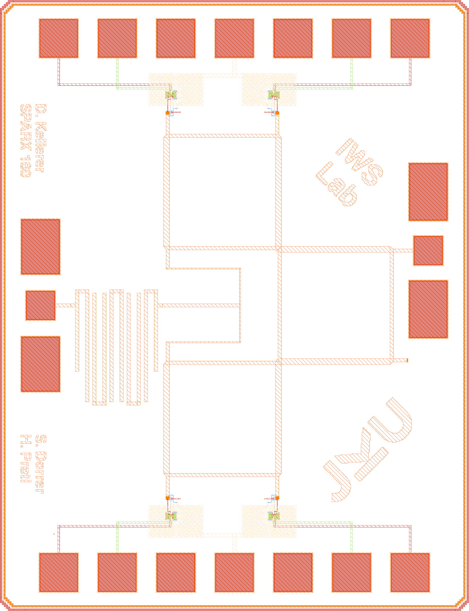
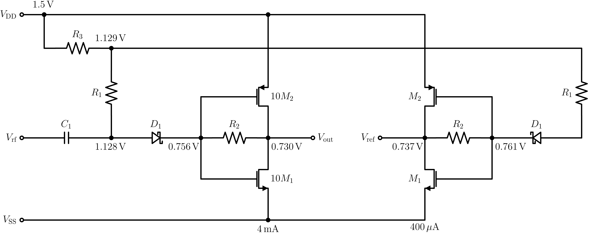

# SPARX: An Open-Source, Automated, Programmatically Generated, Frequency-Scalable Six-Port Receiver in 130-nm CMOS

[](https://github.com/iic-jku/SG13G2_SPARX/actions/workflows/quarto-publish.yml)
[](https://doi.org/10.5281/zenodo.19654232)

(c) 2025-2026 David Kellerer-Pirklbauer, Simon Dorrer and Harald Pretl

Institute for Integrated Circuits and Quantum Computing, Johannes Kepler University (JKU), Linz, Austria

> [!WARNING]
> This repository is a Work in Progress.

> [!IMPORTANT]
> This repository requires the [IIC-OSIC-TOOLS](https://github.com/iic-jku/IIC-OSIC-TOOLS) container with tag `2026.05` or later.

> [!TIP]
> This repository is based on the [ihp-sg13g2-ams-chip-template](https://github.com/iic-jku/ihp-sg13g2-ams-chip-template) template repository. For a better understanding of the folder structure, how to use the Makefiles, and how to implement your own designs, it is recommended to go through this [tutorial](https://iic-jku.github.io/ihp-sg13g2-ams-chip-template/index.html).

<p align="center">
  <a href="doc/fig/sparx160/sparx160_top_white_wo_M5.png">
    
  </a>
  <br>
  <em>Chip render of the ihp-sg13g2 Six-Port Receiver for 160GHz without M5 GND plane (1mm x 1.4mm).</em>
</p>


## Documentation

The full documentation of SPARX is available [here](https://iic-jku.github.io/SG13G2_SPARX/index.html).


## Overview
SPARX stands for Six-Port Automated Receiver. The complete layout is generated in Python using self-made RF devices as a GDSFactory IHP PDK add-on. S-parameter simulation of the passive RF structures is performed with AWS Palace. With KLayout, Magic, and Netgen, a complete LVS, DRC, and RCX verification flow is implemented. The SBD-based power detector is designed in Xschem and simulated with ngspice and VACASK. This repository is controlled by a Makefile. Just clone it and run `make all` to build the six-port receiver at 160 GHz and verify the power detector cell. To generate a frequency-scalable layout at a different target frequency, for example 77 GHz, run `make build-layout FREQ=77`. The following video demonstrates the generation of six-port receivers from 60 GHz to 300 GHz in under one minute.

**Index Terms:** Branch-line coupler, frequency-scalable layout, GDSFactory, hairpin coupled-line bandpass filter, IHP Open-PDK, mmWave, open-source EDA, power detector, programmatic layout, Schottky barrier diode, six-port receiver, Wilkinson power divider.

https://github.com/user-attachments/assets/a1e6cacb-4a70-4f2c-9b7a-f4b6fbb5a47a
<p align="center">
  <em>Generation of Six-Port Receivers from 60 GHz to 300 GHz.</em>
</p>


## References
To understand the principle of six-port receivers and their architectures, it is recommended to read the following references:
- A. Koelpin, G. Vinci, B. Laemmle, D. Kissinger and R. Weigel, "The Six-Port in Modern Society," in IEEE Microwave Magazine, vol. 11, no. 7, pp. 35-43, Dec. 2010, doi: 10.1109/MMM.2010.938584: https://ieeexplore.ieee.org/document/5590352
- T. Hentschel, "The six-port as a communications receiver," in IEEE Transactions on Microwave Theory and Techniques, vol. 53, no. 3, pp. 1039-1047, March 2005, doi: 10.1109/TMTT.2005.843507: https://ieeexplore.ieee.org/document/1406309
- M. Mailand, "System Analysis of Six-Port-Based RF-Receivers," in IEEE Transactions on Circuits and Systems I: Regular Papers, vol. 65, no. 1, pp. 319-330, Jan. 2018, doi: 10.1109/TCSI.2017.2734922: https://ieeexplore.ieee.org/document/8011483


## Requirements

To build this six-port receiver, the following tools and their respective dependencies are required:
- GDSFactory: https://github.com/gdsfactory/gdsfactory
- Updated IHP-Open-PDK GDSFactory version: https://github.com/iic-jku/IHP/tree/IHP-TO
- IHP-Open-PDK: https://github.com/iic-jku/IHP-Open-PDK

The updated IHP-Open-PDK GDSFactory version contains all self-made RF devices and wraps existing PCells provided by the IHP-Open-PDK, allowing them to be used directly within the GDSFactory framework. We choose this approach because it requires very little maintenance. If IHP changes the layout of a cell, no wrapper update is necessary. Only interface changes to a PCell function require updates on our side.


## Block Diagram
- Six-Port
  - Branch Line Coupler (BLC)
  - Wilkinson Power Divider (WPD)
  - Hairpin Coupled-Line Bandpass Filter (BPF)
- Power Detector (PD)
  - Schottky Barrier Diode (SBD)
- Metal Stack
  - TopMetal2 (TM2): RF traces
  - Metal5 (M5): GND plane

<p align="center">
  <a href="doc/fig/sparx_blockdiagram/sparx_blockdiagram.png">
    
  </a>
  <br>
  <em>Block Diagram of the Six-Port Receiver.</em>
</p>


## Schematic of SBD-based Power Detector

<p align="center">
  <a href="doc/fig/sparx_powdet_sbd/sparx_powdet_sbd_circuit.png">
    
  </a>
  <br>
  <em>Schematic of SBD-based Power Detector.</em>
</p>


## Chip Specifications

| Parameter           | Value                                                                             |
| ------------------- | --------------------------------------------------------------------------------- |
| Technology          | IHP SG13G2 (130nm CMOS)                                                           |
| Die Area            | 1000 × 1400 µm (1.4 mm²)                                                          |
| Supply Voltage      | 1.5 V                                                                             |


## ToDo List
- [ ] KLayout LVS --> CMIM issues with PWell.block layer: see [IHP Open-PDK issue](https://github.com/IHP-GmbH/IHP-Open-PDK/issues/958)
- [ ] Change DBU from 5 nm to 1 nm in code: @davkel99
- [ ] Update GDSFactory IHP PDK `main` branch from `IHP-TO` branch: @davkel99
- [ ] Clean up private repo and add SPARX as module: @davkel99
- [ ] Add Top-level Six-Port simulation in Xschem: @simi1505


## Directory Structure

```text
📁 SG13G2_SPARX/
├─ 📁 .github/
│  └─ 📁 workflows/
│     └─ quarto-publish.yml
├─ 📁 doc/
│  ├─ 📁 fig/
│  ├─ 📁 videos/
│  ├─ _quarto.yml
│  ├─ index.qmd
│  └─ Makefile
├─ 📁 layout/
│  ├─ sparx60_top.gds
│  ├─ ...
│  ├─ sparx160_top.gds
│  ├─ ...
│  ├─ sparx300_top.gds
│  ├─ sparx_powdet_sbd.gds
│  └─ sparx_powdet_sbd_flat.gds
├─ 📁 measurements/
│  └─ README.md
├─ 📁 netlist/
│  ├─ 📁 layout/
│  │  ├─ sparx_powdet_sbd_klayout.cir
│  │  └─ sparx_powdet_sbd_magic.ext.spc
│  ├─ 📁 pex/
│  │  ├─ reorder_spice_pins.py
│  │  ├─ sparx_powdet_sbd_klayout_pex.spice
│  │  └─ sparx_powdet_sbd_magic_pex.spice
│  └─ 📁 schematic/
│     ├─ sparx_powdet_sbd_klayout.cdl
│     └─ sparx_powdet_sbd_magic.spice
├─ 📁 release/
│  └─ 📁 v.1.0.0/
│     ├─ 📁 gds/
│     │  └─ RFFE6027.gds
│     ├─ 📁 img/
│     └─ ReleaseNote.md
├─ 📁 render/
│  └─ 📁 img/
│     ├─ sparx160_top_black.png
│     └─ sparx160_top_white.png
├─ 📁 schematic/
│  ├─ sparx_powdet_sbd.sch
│  ├─ sparx_powdet_sbd.sym
│  ├─ sparx_powdet_sbd_pex.sym
│  └─ xschemrc
├─ 📁 scripts/
│  ├─ 📁 assets/
│  ├─ lay2img.py
│  ├─ make_gds.py
│  ├─ s2spice.py
│  ├─ six_port_gen.py
│  ├─ sparx_powdet_sbd_circuit.ipynb
│  └─ sparx_powdet_sbd_eval.py
├─ 📁 sscs-ose-code-a-chip/
│  ├─ 📁 assets/
│  ├─ README.md
│  ├─ SPARX_JKU_VLSI2026.ipynb
├─ 📁 testbenches/
│  ├─ sparx_powdet_sbd_tb.sch
│  ├─ sparx_powdet_sbd_tb_vacask.sch
│  └─ xschemrc
├─ 📁 verification/
│  ├─ 📁 drc/
│  │  ├─ sparx160_top.magic.drc.rpt
│  │  ├─ sparx160_top_sparx160_top_full.lyrdb
│  │  ├─ sparx_powdet_sbd.magic.drc.rpt
│  │  └─ sparx_powdet_sbd_sparx_powdet_sbd_full.lyrdb
│  ├─ 📁 em/
│  │  ├─ 📁 layout/
│  │  ├─ 📁 palace_model/
│  │  └─ 📁 scripts/
│  └─ 📁 lvs/
│     ├─ sparx_powdet_sbd.lvs.out
│     └─ sparx_powdet_sbd.lvsdb
├─ .gitattributes
├─ .gitignore
├─ CITATION.cff
├─ LICENSE
├─ Makefile
└─ README.md
```


## Makefile Targets

### Show Available Targets

The default Make target is `help`, so running `make` prints usage and all available targets with short descriptions.

```sh
make
make help
```

### Build PDK

Clones and installs the IHP-Open-PDK repository with GDSFactory cells:

```sh
make build-pdk
```

### Build SPARX Layout

Generates the six-port layout GDS files for a specific frequency (e.g. `layout/sparx160_top.gds` and `layout/sparx_powdet_sbd.gds` for the default 160 GHz, or `layout/sparx77_top.gds` and `layout/sparx_powdet_sbd.gds` for 77 GHz):

```sh
make build-layout
make build-layout FREQ=77
make build-layout FREQ=77 NO_FILL=1
make build-layout FREQ=77 NO_FILL_M5=1
```

The `FREQ` parameter sets the design frequency in GHz (default: `160`). `NO_FILL=1` disables metal fill (faster for layout preview). `NO_FILL_M5=1` disables only the Metal5 ground fill.

### Build Frequency Sweep Automatically

Builds a frequency sweep by repeatedly calling `build-layout` for each frequency from `START_FREQ` to `STOP_FREQ` using `STEP_FREQ`.

```sh
make build-layout-sweep
make build-layout-sweep START_FREQ=60 STOP_FREQ=300 STEP_FREQ=20
make build-layout-sweep START_FREQ=60 STOP_FREQ=300 STEP_FREQ=20 NO_FILL=1
make build-layout-sweep START_FREQ=60 STOP_FREQ=300 STEP_FREQ=20 NO_FILL_M5=1
```

Default sweep settings are `START_FREQ=60`, `STOP_FREQ=300`, and `STEP_FREQ=20` (all in GHz). `NO_FILL` and `NO_FILL_M5` are forwarded to each `build-layout` run.

### Build Top Cell

Builds the top-level cell by running `build-pdk`, `build-layout`, and `render-gds`:

```sh
make build-top
```

### Render Top Layout

Renders the top-level GDS and saves it in the `render/img/` folder:

```sh
make render-gds
```

### Export Schematic Netlist for LVS

Exports the schematic netlist for LVS from Xschem and places it in `netlist/schematic/`.

The `EV_PRECISION` parameter sets the number of significant digits used by Xschem's `ev` function when calculating device properties (default: 5). Increase this to avoid LVS mismatches caused by floating-point rounding differences between Xschem and KLayout (see [xschem#465](https://github.com/StefanSchippers/xschem/issues/465)).

Currently, KLayout LVS extracts `ntap` and `ptap` devices, so the schematic netlist must include them as well. In contrast, Magic + Netgen LVS does not extract `ntap` and `ptap`. Therefore, the schematic uses `lvs_ignore = short` for these devices and conditional net labels (see https://github.com/StefanSchippers/xschem/issues/474). To make this effective during schematic netlist export, `set lvs_ignore 1` must be set in the `magic-lvs-netlist` target.

KLayout uses CDL netlists, while Magic uses SPICE netlists. Accordingly, `klayout-lvs-netlist` uses the Xschem commands `set spiceprefix 1`, `set lvs_netlist 1`, `set top_is_subckt 1`, and `set lvs_ignore 0`. In contrast, `magic-lvs-netlist` uses `set spiceprefix 1`, `set lvs_netlist 0`, `set top_is_subckt 1`, and `set lvs_ignore 1`.

To extract a CDL schematic netlist for KLayout LVS, use the following target:
```sh
make klayout-lvs-netlist
make klayout-lvs-netlist CELL=sparx_powdet_sbd
make klayout-lvs-netlist EV_PRECISION=5
```

To extract a SPICE schematic netlist for Magic + Netgen LVS, use the following target:
```sh
make magic-lvs-netlist
make magic-lvs-netlist CELL=sparx_powdet_sbd
make magic-lvs-netlist EV_PRECISION=5
```

### Layout Versus Schematic (LVS)

Exports the schematic netlist from Xschem, then runs LVS. Compares the GDS layout in `layout/` against the schematic netlist in `netlist/schematic/`. Reports are saved to `verification/lvs/`. The extracted layout netlist is moved to `netlist/layout/`.

**KLayout LVS** uses `run_lvs.py` from the IHP Open-PDK:

```sh
make klayout-lvs
make klayout-lvs CELL=sparx_powdet_sbd
```

**Magic + Netgen LVS** uses `sak-lvs.sh`:

```sh
make magic-lvs
make magic-lvs CELL=sparx_powdet_sbd
```

### Design Rule Check (DRC)

Runs DRC on the GDS layout in `layout/`. Reports are saved to `verification/drc/`.

**KLayout DRC (regular)** runs the full DRC rule set on the top-level cell:

```sh
make klayout-drc-regular
```

**KLayout DRC** uses `run_drc.py` from the IHP Open-PDK with relaxed rules (FEOL, density checks, and extra rules disabled):

```sh
make klayout-drc
make klayout-drc CELL=sparx_powdet_sbd
```

**Magic DRC** uses `sak-drc.sh`:

```sh
make magic-drc
make magic-drc CELL=sparx_powdet_sbd
```

### Parasitic Extraction (PEX)

Runs parasitic extraction on the GDS layout in `layout/`. The extracted SPICE netlist is written to `netlist/pex/`.

The `EXT_MODE` parameter selects the extraction mode:
- `1` = C-decoupled
- `2` = C-coupled
- `3` = full-RC (default)

> **Note:** For `klayout-pex`, `EXT_MODE=1` (C-decoupled) is not yet supported by kpex and automatically falls back to `EXT_MODE=2` (CC) with a warning.

The `.subckt` name in the extracted SPICE file is automatically renamed from `<CELL>_flat` (kpex) or `<CELL>` (Magic) to `<CELL>_pex`.

If a matching Xschem symbol (`schematic/<CELL>_pex.sym`) exists, the `.subckt` pin order in the extracted SPICE file is automatically reordered to match the symbol's pin positions. This ensures the PEX netlist can be used directly with the corresponding Xschem symbol for simulation.

**KLayout PEX** uses `kpex` with the Magic extraction engine currently (2.5D engine is work in progress):

```sh
make klayout-pex
make klayout-pex CELL=sparx_powdet_sbd
make klayout-pex CELL=sparx_powdet_sbd EXT_MODE=3
```

**Magic PEX** uses `sak-pex.sh`:

```sh
make magic-pex
make magic-pex CELL=sparx_powdet_sbd
make magic-pex CELL=sparx_powdet_sbd EXT_MODE=3
```

### Verify a Specific Cell

Runs LVS, DRC, and PEX for a specific cell (e.g. `sparx_powdet_sbd`):

```sh
make klayout-verify CELL=sparx_powdet_sbd
make magic-verify CELL=sparx_powdet_sbd
```

### Verify Top Cell

Runs LVS, DRC, and PEX for the top cell:

```sh
make klayout-verify
make magic-verify
```

### Build and Verify All

Builds the top-level cell by running `build-top`, then verifies the SBD-based power detector cell with Magic LVS and DRC. Finally, it runs Magic DRC and KLayout DRC for the top-level cell.

```sh
make all
```

### Release

Copies the final top-level GDS from `layout/` to `release/v.<VERSION>/gds/`, the generated netlists into `release/v.<VERSION>/netlist/`, and the rendered images into `release/v.<VERSION>/img/`.

The following folders are exported:

- `layout/<TOP>.gds` -> `release/v.<VERSION>/gds/<TOP>.gds`
- `netlist/schematic` -> `release/v.<VERSION>/netlist/schematic`
- `netlist/layout` -> `release/v.<VERSION>/netlist/layout`
- `render/img/<TOP>_black.png` -> `release/v.<VERSION>/img/<TOP>_black.png`
- `render/img/<TOP>_white.png` -> `release/v.<VERSION>/img/<TOP>_white.png`

Run with default version (`2.0.0`):

```sh
make release
```

Run with a custom version:

```sh
make release VERSION=2.1.0
```


## Cite This Work

```
@software{2026_SPARX,
	author = {Kellerer-Pirklbauer, David and Dorrer, Simon and Pretl, Harald},
	month = apr,
  	year = {2026},
	title = {{GitHub Repository for SPARX: An Open-Source, Automated, Programmatically Generated, Frequency-Scalable Six-Port Receiver in 130-nm CMOS}},
	url = {https://github.com/iic-jku/SG13G2_SPARX},
	doi = {10.5281/zenodo.19654232}
}
```


## Acknowledgements

This project is funded by the JKU/SAL [IWS Lab](https://research.jku.at/de/projects/jku-lit-sal-intelligent-wireless-systems-lab-iws-lab/), a collaboration of [Johannes Kepler University](https://jku.at) and [Silicon Austria Labs](https://silicon-austria-labs.com).

<table width="100%">
  <tr>
    <td align="left" width="50%">
      <a href="https://iic.jku.at" target="_blank">
        
      </a>
    </td>
    <td align="right" width="50%">
      <a href="https://silicon-austria-labs.com" target="_blank">
        
      </a>
    </td>
  </tr>
</table>