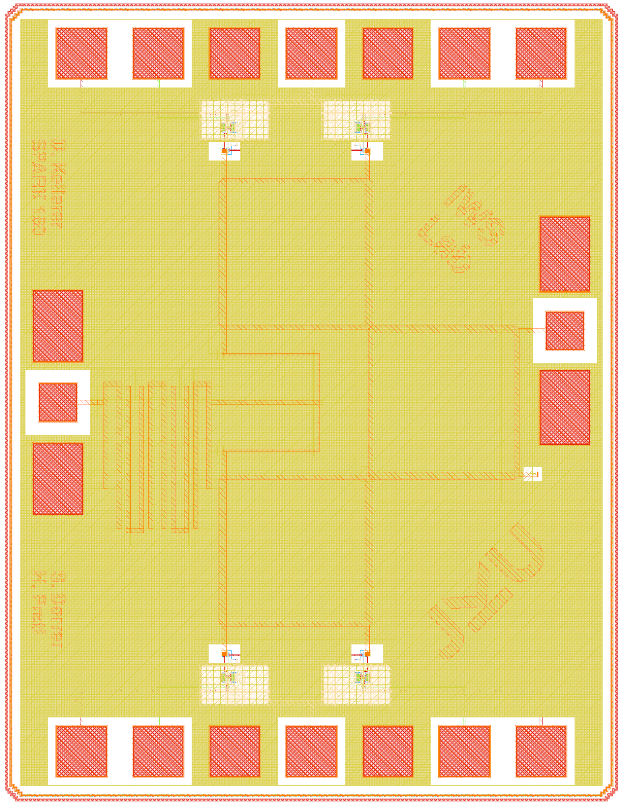
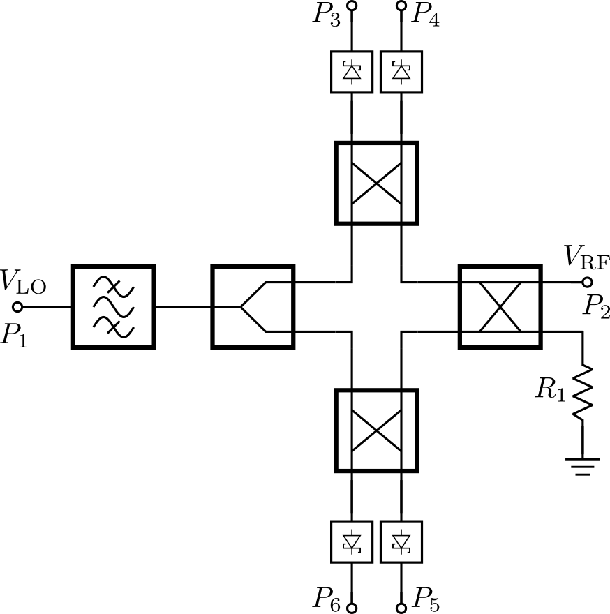

# SPARX160: A Programmatically Generated 160-GHz Six-Port Receiver in 130-nm CMOS

(c) 2025-2026 David Kellerer-Pirklbauer, Simon Dorrer and Harald Pretl



## Overview

- Six-Port
    - Branch Line Coupler (BLC)
        - ToDo
    - Wilkinson Divider
        - ToDo
    - Hairpin Coupled-Line Bandpass Filter
        - ToDo
- Power Detector (PD)
    - Schottky Barrier Diode (SBD)
        - ToDo



## Chip Specifications

| Parameter           | Value                                                                             |
| ------------------- | --------------------------------------------------------------------------------- |
| Technology          | IHP SG13G2 (130nm CMOS)                                                           |
| Die Area            | 1000 × 1400 µm (1.4 mm²)                                                          |
| Supply Voltage      | 1.5 V                                                                             |

## Cite This Work

```
@software{2026_SPARX160,
	author = {Kellerer-Pirklbauer, David and Dorrer, Simon and Pretl, Harald},
	month = April,
	title = {{GitHub Repository for SPARX160: A Programmatically Generated 160-GHz Six-Port Receiver in 130-nm CMOS}},
	url = {https://github.com/iic-jku/SG13G2_SPARX160},
	doi = {ToDo},
	year = {2026}
}
```

## Acknowledgements

This project is funded by the JKU/SAL [IWS Lab](https://research.jku.at/de/projects/jku-lit-sal-intelligent-wireless-systems-lab-iws-lab/), a collaboration of [Johannes Kepler University](https://jku.at) and [Silicon Austria Labs](https://silicon-austria-labs.com).

<p align="center">
  <a href="https://silicon-austria-labs.com" target="_blank">
    
  </a>
</p>