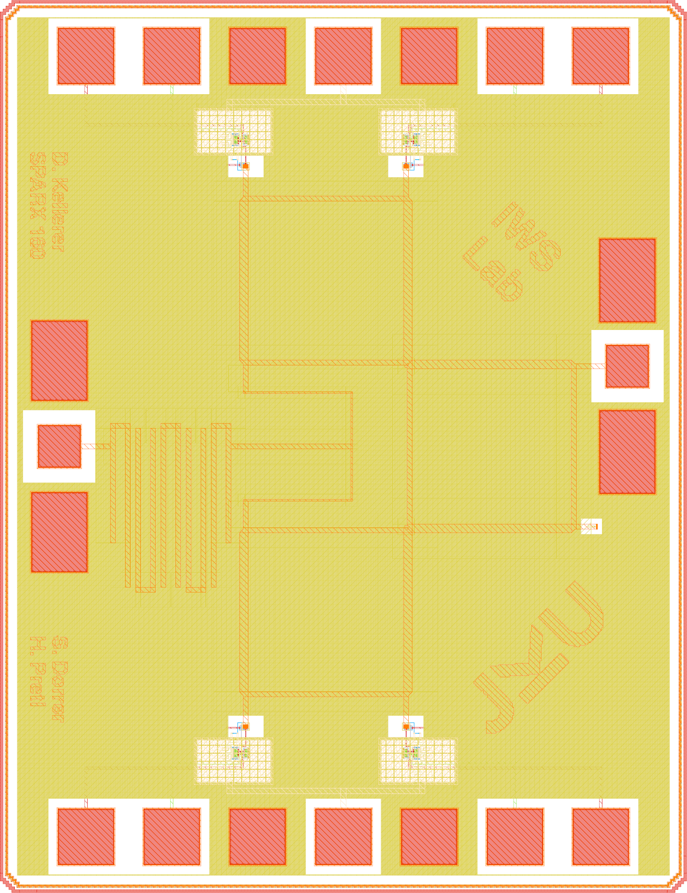

::: {.callout-warning}
This documentation is a Work in Progress.
:::

::: {.callout-important}
This repository requires the [IIC-OSIC-TOOLS](https://github.com/iic-jku/IIC-OSIC-TOOLS) container with tag `2026.05` or later.
:::

## Overview

SPARX stands for **Six-Port Automated Receiver**. The complete layout is generated in Python using self-made RF devices as a GDSFactory IHP PDK add-on. S-parameter simulation of the passive RF structures is performed with AWS Palace. With KLayout, Magic, and Netgen, a complete LVS, DRC, and RCX verification flow is implemented. The SBD-based power detector is designed in Xschem and simulated with ngspice and VACASK. This repository is controlled by a Makefile. Just clone it and run `make all` to build the six-port receiver at 160 GHz and verify the power detector cell. To generate a frequency-scalable layout at a different target frequency, for example 77 GHz, run `make build-layout FREQ=77`.

**Index Terms:** Branch-line coupler, frequency-scalable layout, GDSFactory, hairpin coupled-line bandpass filter, IHP Open-PDK, mmWave, open-source EDA, power detector, programmatic layout, Schottky barrier diode, six-port receiver, Wilkinson power divider.

## References

To understand the principle of six-port receivers and their architectures, it is recommended to read the following references:

- A. Koelpin, G. Vinci, B. Laemmle, D. Kissinger and R. Weigel, "The Six-Port in Modern Society," in *IEEE Microwave Magazine*, vol. 11, no. 7, pp. 35–43, Dec. 2010, doi: [10.1109/MMM.2010.938584](https://doi.org/10.1109/MMM.2010.938584)
- T. Hentschel, "The six-port as a communications receiver," in *IEEE Transactions on Microwave Theory and Techniques*, vol. 53, no. 3, pp. 1039–1047, March 2005, doi: [10.1109/TMTT.2005.843507](https://doi.org/10.1109/TMTT.2005.843507)
- M. Mailand, "System Analysis of Six-Port-Based RF-Receivers," in *IEEE Transactions on Circuits and Systems I: Regular Papers*, vol. 65, no. 1, pp. 319–330, Jan. 2018, doi: [10.1109/TCSI.2017.2734922](https://doi.org/10.1109/TCSI.2017.2734922)

## Requirements

To build this six-port receiver, the following tools and their respective dependencies are required:

- GDSFactory: https://github.com/gdsfactory/gdsfactory
- Updated IHP-Open-PDK GDSFactory version: https://github.com/iic-jku/IHP/tree/IHP-TO
- IHP-Open-PDK: https://github.com/iic-jku/IHP-Open-PDK

The updated IHP-Open-PDK GDSFactory version contains all self-made RF devices and wraps existing PCells provided by the IHP-Open-PDK, allowing them to be used directly within the GDSFactory framework. This approach requires very little maintenance: if IHP changes the layout of a cell, no wrapper update is necessary — only interface changes to a PCell function require updates.

## Block Diagram

The SPARX architecture consists of the following main components:

- **Six-Port**
  - Branch Line Coupler (BLC)
  - Wilkinson Power Divider (WPD)
  - Hairpin Coupled-Line Bandpass Filter (BPF)
- **Power Detector (PD)**
  - Schottky Barrier Diode (SBD)
- **Metal Stack**
  - TopMetal2 (TM2): RF traces
  - Metal5 (M5): GND plane

{fig-align="center" width=75%}

## SBD-based Power Detector

{fig-align="center" width=100%}

## Layouts

The following figures show the chip layout of the 160 GHz six-port receiver (die area: 1000 × 1400 µm).

::: {layout-ncol=2}
{fig-align="center"}

{fig-align="center"}
:::

| Parameter      | Value                   |
|----------------|-------------------------|
| Technology     | IHP SG13G2 (130 nm CMOS)|
| Die Area       | 1000 × 1400 µm (1.4 mm²)|
| Supply Voltage | 1.5 V                   |

: Chip Specifications {tbl-colwidths="[35,65]"}

## Acknowledgements

This project is funded by the JKU/SAL [IWS Lab](https://research.jku.at/de/projects/jku-lit-sal-intelligent-wireless-systems-lab-iws-lab/), a collaboration of [Johannes Kepler University](https://jku.at) and [Silicon Austria Labs](https://silicon-austria-labs.com).

<table width="100%">
  <tr>
    <td align="left" width="50%">
      
    </td>
    <td align="right" width="50%">
      
    </td>
  </tr>
</table>